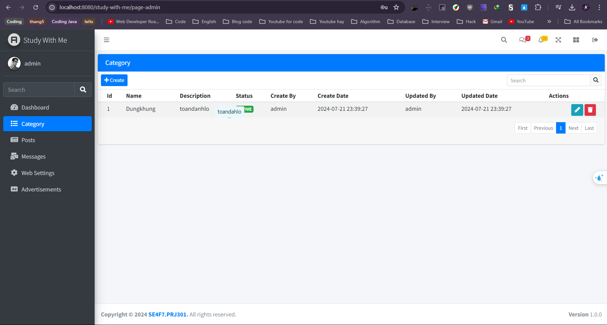
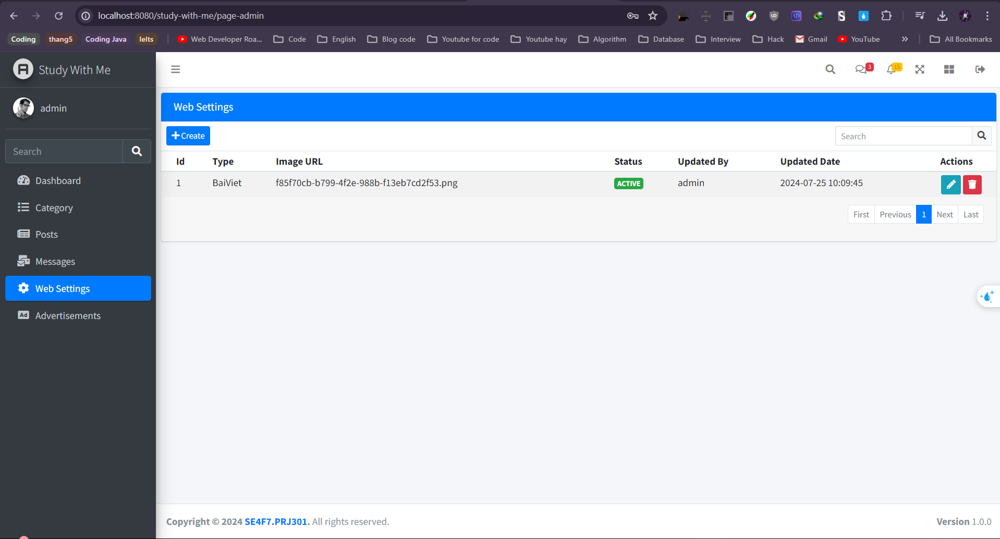
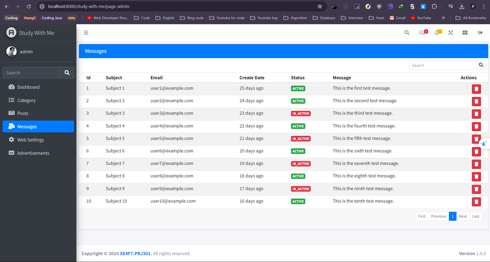
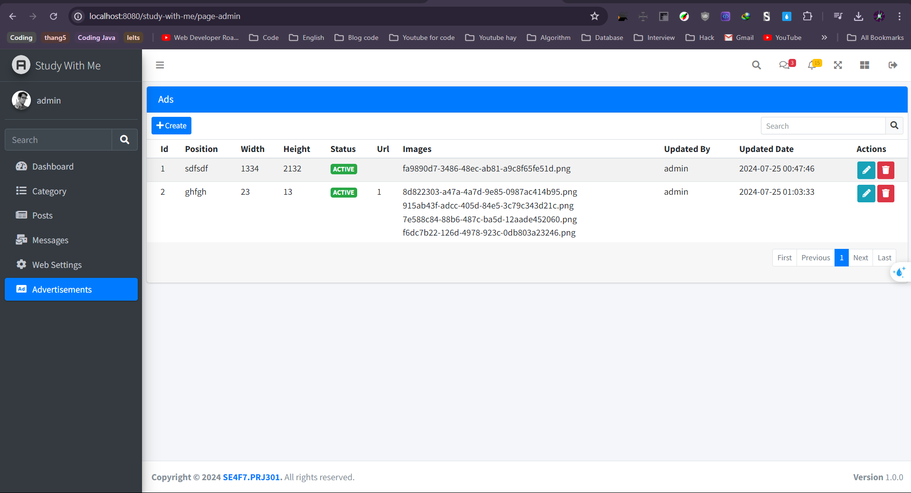
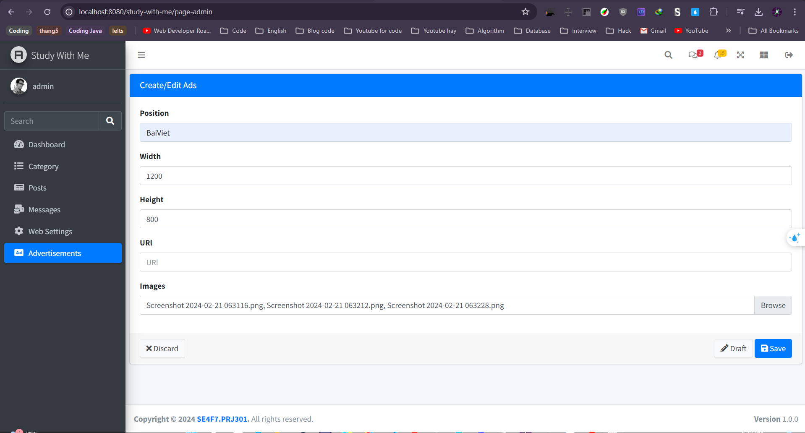
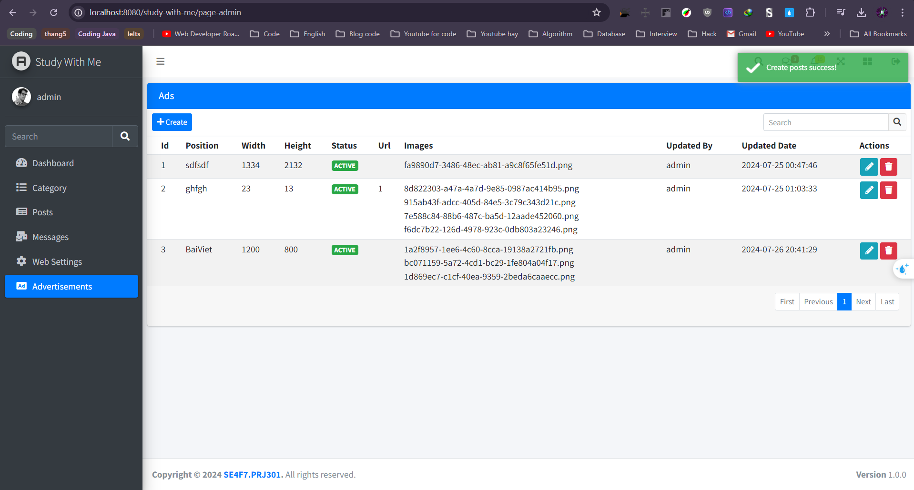
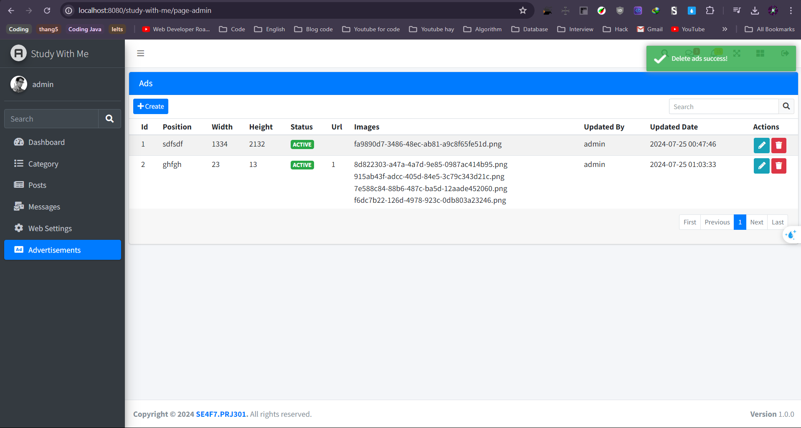

# study-with-me
To run this java project 
Install Tomcat 8.5 and Build Maven 
After run this project by Tomcat sever: 

- Login 

- Web setting
  
-Message

-Advertisements

-- Search Type , Subject , Possion